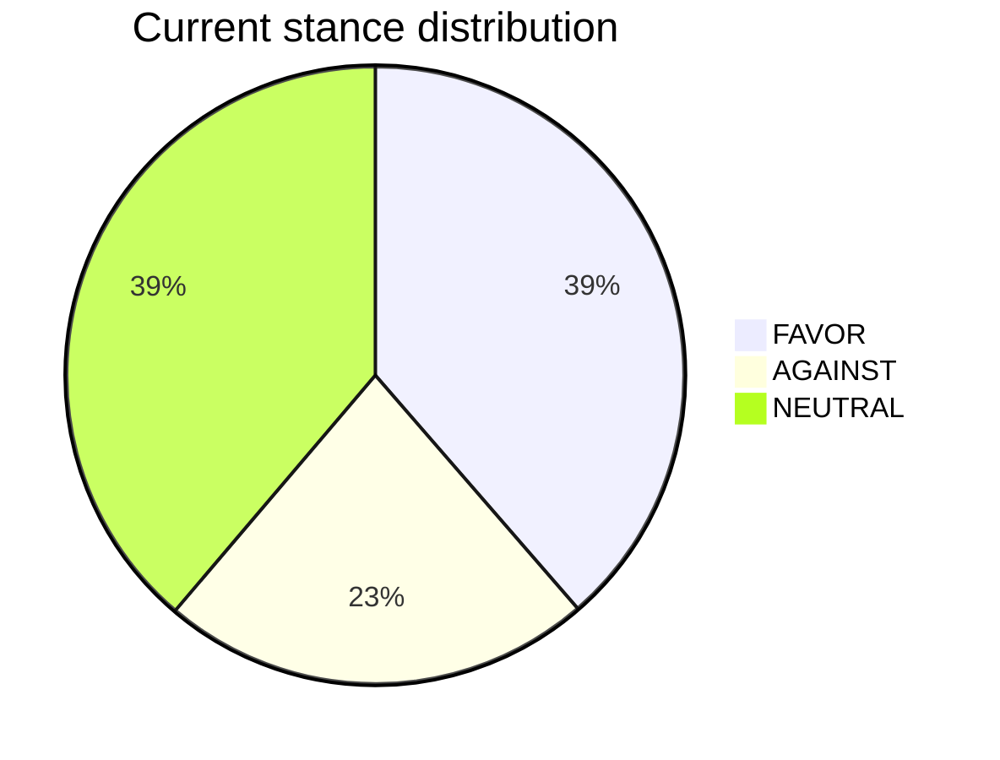
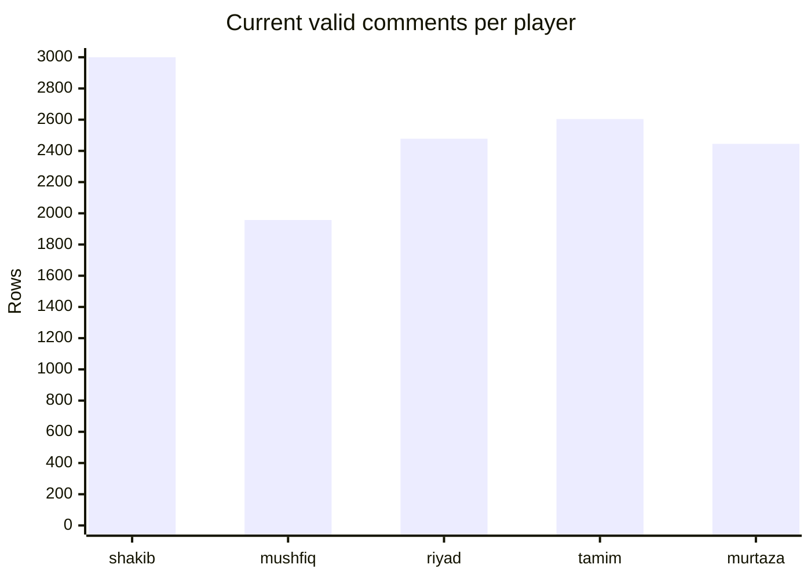
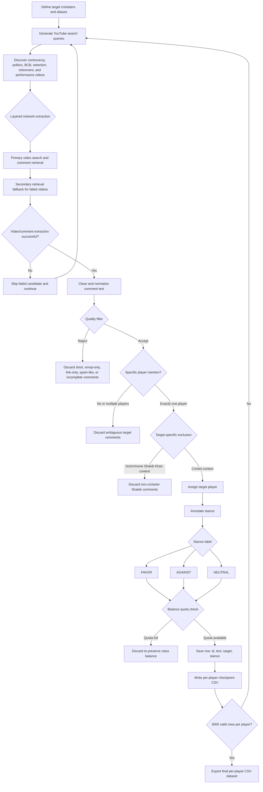

# Bangladesh Cricketer YouTube Stance Dataset Pipeline

This project collects YouTube comments, filters for complete comments that explicitly mention one target player, and labels stance data for:

- `shakib`
- `mushfiq`
- `riyad`
- `tamim`
- `murtaza`

Each CSV uses this schema:

```csv
id,text,target,stance
```

Allowed stance labels are `FAVOR`, `AGAINST`, and `NEUTRAL`.

## Current Dataset Snapshot

Snapshot date: `2026-07-03`

Current checkpoint data contains `12,484` valid annotated comments across the five target cricketers. The working target is `3,000` valid rows per player, with balanced stance coverage where possible.

| Target player | CSV file | Current rows | FAVOR | AGAINST | NEUTRAL | Progress to 3,000 |
|---|---:|---:|---:|---:|---:|---:|
| Shakib Al Hasan | `data/checkpoints/shakib.csv` | 3,000 | 1,000 | 1,000 | 1,000 | 100.0% |
| Mushfiqur Rahim | `data/checkpoints/mushfiq.csv` | 1,957 | 822 | 293 | 842 | 65.2% |
| Mahmudullah Riyad | `data/checkpoints/riyad.csv` | 2,478 | 1,000 | 478 | 1,000 | 82.6% |
| Tamim Iqbal | `data/checkpoints/tamim.csv` | 2,604 | 1,000 | 604 | 1,000 | 86.8% |
| Mashrafe Mortaza | `data/checkpoints/murtaza.csv` | 2,445 | 1,000 | 445 | 1,000 | 81.5% |
| **Total** | `data/checkpoints/*.csv` | **12,484** | **4,822** | **2,820** | **4,842** | **83.2%** |

### Stance Distribution

| Stance | Count | Share |
|---|---:|---:|
| FAVOR | 4,822 | 38.6% |
| AGAINST | 2,820 | 22.6% |
| NEUTRAL | 4,842 | 38.8% |



### Player Coverage



Current status: Shakib is complete and balanced at `1,000` comments per stance. The remaining players still need more `AGAINST` examples to reach a fully balanced `3,000` row dataset. FAVOR and NEUTRAL quotas are already full for Riyad, Tamim, and Murtaza, so the next scraping rounds should prioritize controversy-heavy videos and comments that produce valid AGAINST examples for the incomplete players.

## Pipeline Diagram



For a paper, the pipeline can be summarized as query generation, layered network extraction, fault-tolerant video skipping, comment quality filtering, target-player validation, non-cricketer Shakib removal, stance annotation, class balancing, checkpointing, and final CSV export.

## Data Quality Rules

The scraper rejects comments that:

- have 6 words or fewer
- do not mention exactly one target player alias
- are emoji-only, link-only, spam-like, or mostly non-text
- do not look like a complete sentence
- mention multiple target players, because the target becomes ambiguous

## Video Discovery

Search is controversy-focused by default. The scraper looks for videos around:

- political and election-related cricket discussion
- BCB, selection, captaincy, retirement, ban, and scandal controversy
- performance criticism after major tournaments and matches
- press conferences, interviews, news analysis, debates, and fan reactions

All aliases for each player are used in search, including full names and spelling variants.
Bangla player-name aliases and Bangla controversy search terms are included.

## Setup

```bash
python3 -m venv .venv
source .venv/bin/activate
pip install -r requirements.txt
```

For transformer fallback support:

```bash
pip install -r requirements-transformer.txt
```

Your `.env` should contain:

```bash
GEMINI_API_KEY=...
GEMINI_MODEL=gemini-2.5-flash
ANNOTATION_BATCH_SIZE=50
RANDOM_SEED=42
```

`GEMINI_MODEL` is optional. If omitted, the script uses `gemini-2.5-flash`.

## Run

Gemini primary with transformer fallback:

```bash
python scrape_stance_dataset.py
```

Gemini primary with keyword fallback:

```bash
python scrape_stance_dataset.py --fallback local
```

No API, local keyword rules only:

```bash
python scrape_stance_dataset.py --annotator local
```

Local transformer only:

```bash
python scrape_stance_dataset.py --annotator transformer
```

Outputs are saved in `data/`:

- `data/shakib.csv`
- `data/mushfiq.csv`
- `data/riyad.csv`
- `data/tamim.csv`
- `data/murtaza.csv`

Progress is saved continuously in `data/checkpoints/`, so you can stop and restart safely.

## Useful Options

```bash
python scrape_stance_dataset.py --per-player 3000
python scrape_stance_dataset.py --min-words 7
python scrape_stance_dataset.py --comments-per-video 800
python scrape_stance_dataset.py --videos-per-query 30
python scrape_stance_dataset.py --output-dir data
```

The scraper uses a layered network extraction design: search discovery, comment retrieval, text filtering, target validation, stance labeling, balancing, and checkpointed export are separated into recoverable stages. If a video or query fails, the pipeline skips it and continues from the next candidate without losing previously collected rows.

Run one player at a time:

```bash
python scrape_stance_dataset.py --players shakib
python scrape_stance_dataset.py --players mushfiq
python scrape_stance_dataset.py --players riyad
python scrape_stance_dataset.py --players tamim
python scrape_stance_dataset.py --players murtaza
```
